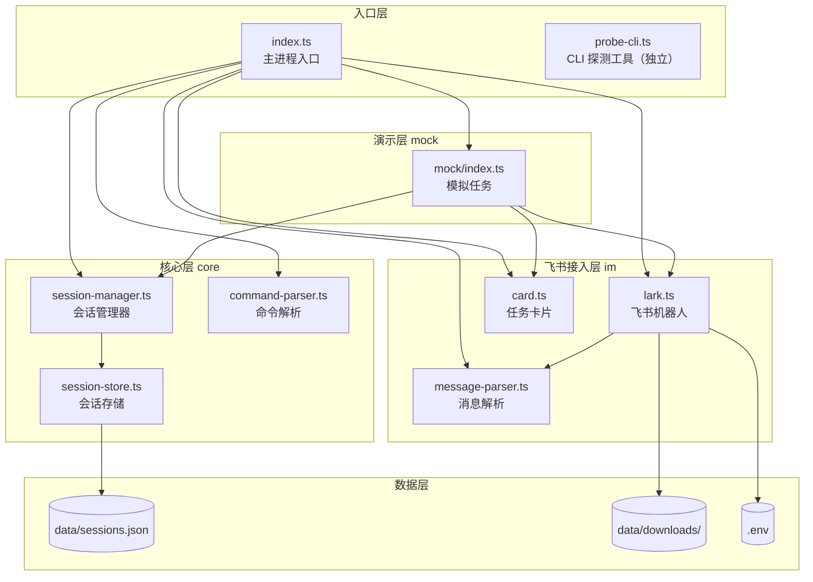
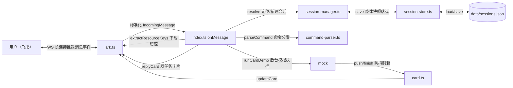

# 01 - 项目总览与架构

> 本文档基于当前 `src/` 全部源码梳理，目标是让任何人（或 AI）快速读懂整个项目。

## 1. 项目定位

**agent-os（anent-os）**：把飞书变成 AI 编程 CLI（Claude Code / Codex）的指挥台。

核心设想：

- **一个话题 = 一个任务**：用户在飞书里新开一个话题发指令，机器人就开一个"会话"去执行任务；
- **bot 之间可互相 @ 协作**：消息里的 @ 提及会被解析还原，将来 bot 可以 @ 真人拍板；
- **cron 定时巡检**（规划中）。

**当前阶段**：还是一个 **demo bot** —— 收到消息后，用一张"模拟任务"卡片假装执行任务、逐步刷新进度，跑完 8 步后显示完成。真实的 CLI 调用（Claude Code / Codex）尚未接入。

## 2. 技术栈与运行环境

| 项目 | 值 |
| --- | --- |
| 语言 | TypeScript（strict 模式） |
| 运行时 | Node.js >= 22，ESM only（`"type": "module"`） |
| 包管理 | pnpm（`pnpm@10.28.0`） |
| 飞书 SDK | `@larksuiteoapi/node-sdk`（WS 长连接 + REST API） |
| 校验 | `zod`（会话文件数据校验） |
| 环境变量 | `dotenv`（凭证只放 .env） |
| 开发运行 | `tsx watch`（热重载） |

## 3. 目录结构

```
anent-os/
├── data/
│   ├── downloads/          # 收到的图片/文件下载目录
│   └── sessions.json       # 会话持久化文件（唯一的数据存储）
├── src/
│   ├── index.ts            # 入口：启动机器人 + 消息处理主流程
│   ├── probe-cli.ts        # 独立小工具：观察 Claude Code/Codex 的流式输出
│   ├── core/
│   │   ├── command-parser.ts    # 斜杠命令解析（/close /status /help）
│   │   ├── session-manager.ts   # 会话管理器（内存表 + 状态机 + 持久化调度）
│   │   └── session-store.ts     # 会话文件存储（JSON 原子写 + zod 校验）
│   ├── im/
│   │   ├── lark.ts              # 飞书机器人封装（WS 长连接 + 回复/下载/卡片）
│   │   ├── message-parser.ts    # 消息解析（@提及还原、资源 key 提取）
│   │   └── card.ts              # 任务卡片构建 + 防抖更新器
│   └── mock/
│       └── index.ts             # 模拟任务演示（当前阶段的"假执行"）
├── .env / .env.example     # 飞书应用凭证
├── CLAUDE.md               # 项目说明 + 错题本约定
├── package.json / tsconfig.json
└── doc/                    # 本文档目录
```

## 4. 分层架构与模块依赖



### 各模块职责一句话

| 模块 | 职责 |
| --- | --- |
| `index.ts` | 组装一切：恢复会话 → 启动飞书长连接 → 处理每条消息（命令分发 / 状态拦截 / 派发任务） |
| `lark.ts` | 与飞书打交道的唯一出口：长连接收事件、回复文本、下载资源、收发卡片 |
| `message-parser.ts` | 消息的"翻译官"：@占位符还原、提取图片/文件 key |
| `card.ts` | 任务卡片的"UI 层"：生成卡片 JSON；防抖 + 串行队列刷新卡片 |
| `session-manager.ts` | 会话的"大脑"：内存会话表、状态机迁移、触发持久化 |
| `session-store.ts` | 会话的"硬盘"：JSON 文件读写、崩溃恢复、原子写 |
| `command-parser.ts` | 识别 /close /status /help 三种斜杠命令 |
| `mock/index.ts` | 当前阶段的"假任务引擎"：8 步模拟执行 + 进度卡片演示 |
| `probe-cli.ts` | 独立调试工具：把 Claude Code / Codex 的 stream-json 输出翻译成日志 |

## 5. 数据流总览



## 6. 运行方式

```bash
pnpm install        # 安装依赖
cp .env.example .env  # 填入 BOT_A_APP_ID / BOT_A_APP_SECRET

pnpm dev            # 开发：tsx watch 热重载（等价 pnpm start）
pnpm start:once     # 单次运行不监听
pnpm build          # tsc 编译到 dist/
pnpm probe:cli      # CLI 探测工具（配合管道使用）
```

飞书开放平台侧需要：自建应用 → 开通机器人能力 → 开通「消息与事件接收」权限 → 拿到 AppID/AppSecret 填入 `.env`。

## 7. 关键设计决策

1. **WS 长连接代替 Webhook**：无需公网域名、无需 HTTPS 回调地址，本地/内网即可调试（见 `lark.ts` 文件头）。
2. **内存 Map 为准 + 全量快照落盘**：查询零 IO；每次会话变更（新建/迁移）后整体重写 `sessions.json`，量小（会话数级）所以简单可靠。
3. **状态机约束并发**：一个话题同时只跑一个任务（active 期间拒绝追问），杜绝重复执行。
4. **崩溃自愈**：重启时把遗留的 creating/active 会话恢复成 idle，避免"永远执行中"。
5. **原子写 + 串行写队列**：写 `.tmp` 再 rename；Promise 队列保证写入顺序，防止并发写交错损坏文件。
6. **卡片防抖更新**：2 秒窗口内多次进度刷新只发最新一张卡片，避免触发飞书限流。
