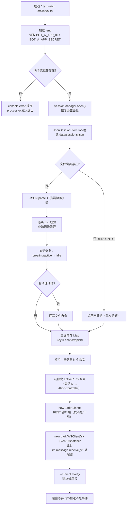
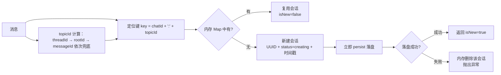
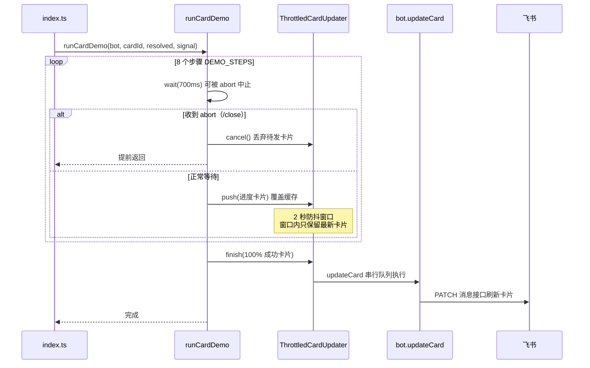
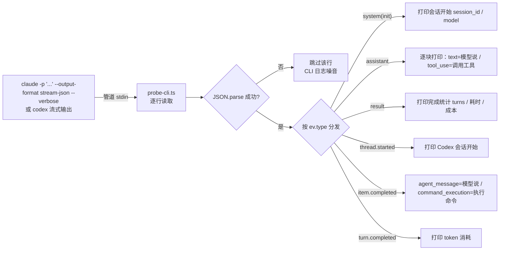

# 02 - 运行流程详解

> 本文按时间顺序拆解整个系统"从启动到处理一条消息"的完整运行过程。

## 1. 进程启动流程

`pnpm start` 实际执行 `tsx watch --include .env src/index.ts`，也就是运行 `src/index.ts`：



**启动阶段做了 4 件事**：

| 步骤 | 做什么 | 关键代码 |
| --- | --- | --- |
| ① 凭证检查 | 缺 AppID/AppSecret 直接退出 | `index.ts` 顶部 |
| ② 会话恢复 | 从 `sessions.json` 读出历史会话，重建内存 Map | `SessionManager.open` → `JsonSessionStore.load` |
| ③ 任务表初始化 | `activeRuns`：会话ID → AbortController，供 /close 中止后台任务 | `index.ts` |
| ④ 飞书接入 | REST 客户端 + WS 长连接 + 事件分发器注册 | `startBot` |

## 2. 收到一条消息：完整处理链路

用户（单聊或群聊话题）发消息 → 飞书推送 `im.message.receive_v1` 事件 → 长连接收到 → 处理。

```mermaid
flowchart TD
    EV[飞书推送 im.message.receive_v1] --> EX[extractText 提取纯文本<br/>text 消息取 text 字段<br/>post 消息拼合文本元素]
    EX --> STD[组装 IncomingMessage 标准消息结构]
    STD --> CB[进入 onMessage 回调]

    CB --> RES[resolveMentions<br/>@_user_N 占位符 → @显示名]
    RES --> HAST[计算 hasThread<br/>有 threadId 或 rootId 即话题内]
    HAST --> SESS[sessions.resolve 定位会话]
    SESS --> N1{"内存 Map 命中<br/>chatId:topicId?"}
    N1 -- 命中 --> N2["复用旧会话 isNew=false"]
    N1 -- 未命中 --> N3["新建会话 status=creating<br/>立即落盘（失败回滚删除）"]
    N3 --> N4["isNew=true"]
    N2 --> CMD[parseCommand 解析命令]
    N4 --> CMD

    CMD --> H{"是 /help?"}
    H -- 是 --> H2["回复命令列表"] --> END
    H -- 否 --> S{"是 /status?"}
    S -- 是 --> S2["formatSessionStatus 回复会话状态"] --> END
    S -- 否 --> C{"是 /close?"}
    C -- 是 --> C2["abort 中止后台任务"]
    C2 --> C3["transition → closed（落盘）"]
    C3 --> C4["回复：会话已关闭"] --> END
    C -- 否 --> ST{"会话状态检查"}

    ST -- closed --> ST1["回复：请新开话题"] --> END
    ST -- creating 且非新建 --> ST2["回复：正在准备，请稍后"] --> END
    ST -- active --> ST3["回复：任务执行中，请等待"] --> END
    ST -- idle（或新会话） --> RUN["transition → active（落盘）"]

    RUN --> AB["new AbortController<br/>activeRuns.set(session.id, run)"]
    AB --> DL["extractResourceKeys<br/>提取 image_key / file_key"]
    DL --> DLS{"有资源?"}
    DLS -- 是 --> DLD["逐个 downloadResource<br/>下载到 data/downloads/"]
    DLS -- 否 --> CARD
    DLD --> CARD["replyCard 发送运行中卡片<br/>（进度 0%）"]
    CARD --> CID{"发送成功<br/>且返回 message_id?"}
    CID -- 否/异常 --> FAIL["清理 activeRuns 句柄<br/>markSessionIdle 回 idle"]
    FAIL --> END
    CID -- 是 --> BG["void runCardDemo 后台执行<br/>（回调立即返回，不阻塞长连接）"]

    BG --> FIN["finally 统一收尾：<br/>摘除 activeRuns<br/>markSessionIdle → idle"]
    FIN --> END
    END[本次消息处理结束]
```

### 2.1 会话定位（第一步核心）



### 2.2 三种斜杠命令

| 命令 | 行为 | 说明 |
| --- | --- | --- |
| `/help` | 回复三条命令的列表 | 不改变会话状态 |
| `/status` | 回复会话 ID / 状态 / 引擎 / 话题 / 更新时间 | 只读 |
| `/close` | abort 后台任务 → 迁移 closed → 回复"已关闭" | 之后该话题所有消息被拒 |

命令解析规则（`command-parser.ts`）：

- 允许 `@机器人 /status` 形式（群聊先 @ 再发命令）；
- 正则 `^(?:@.+\s+)?\/(close|status|help)\s*$`：命令后不能带其他文字；
- 非命令文本（如"帮我看看代码"）返回 `undefined`，按普通任务处理。

### 2.3 后台模拟任务（runCardDemo）



**关键点**：

- 事件回调 `onMessage` 通过 `void runCardDemo(...)` 立即返回，模拟执行完全在后台进行，不阻塞飞书长连接（否则消息会排队积压）；
- 每 700ms 推进一步，进度从 0% 走到 90%（最后 10% 留给收尾）；
- 卡片刷新走 `ThrottledCardUpdater`：2 秒窗口内多次 push 只发最新一张；更新请求串行排队；
- `/close` 通过 `AbortController` 中止 `wait`，任务立即取消，卡片更新器 `cancel`；
- `finally` 统一收尾：摘除 `activeRuns` 句柄 + 会话迁移回 idle（若期间被 /close 置为 closed 则跳过）。

## 3. probe-cli 工具流程（独立于主进程）



用途：机器人将来把任务转给 Claude Code / Codex 时，可用它实时观察 CLI 的每一步动作，作为任务日志。

## 4. 一次完整对话的时间线示例

假设用户单聊发来："帮我梳理项目结构"：

| 时刻 | 事件 | 会话状态 | 磁盘状态 |
| --- | --- | --- | --- |
| T0 | 用户发消息 | — | — |
| T1 | resolve 未命中 → 新建会话 | creating | 立即写盘（新增 1 条） |
| T2 | 命令解析（非命令）→ 状态检查通过 | creating | — |
| T3 | transition → active | active | 写盘 |
| T4 | 下载资源（无）→ 发运行中卡片 | active | — |
| T5 | runCardDemo 后台跑 8 步，约 5.6 秒 | active | — |
| T6 | 任务完成 → finally 收尾 | idle | 写盘 |
| T7 | 用户发"/status" | idle | —（只读，不写盘） |
| T8 | 用户发"/close" | closed | 写盘 |
| T9 | 用户再发消息 | closed | 被拒："请新开话题" |
