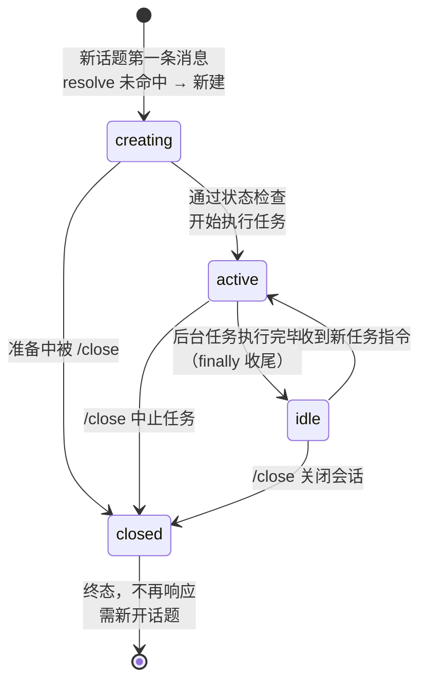
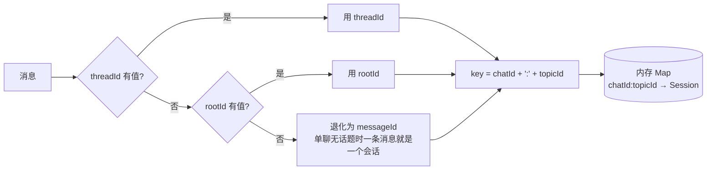
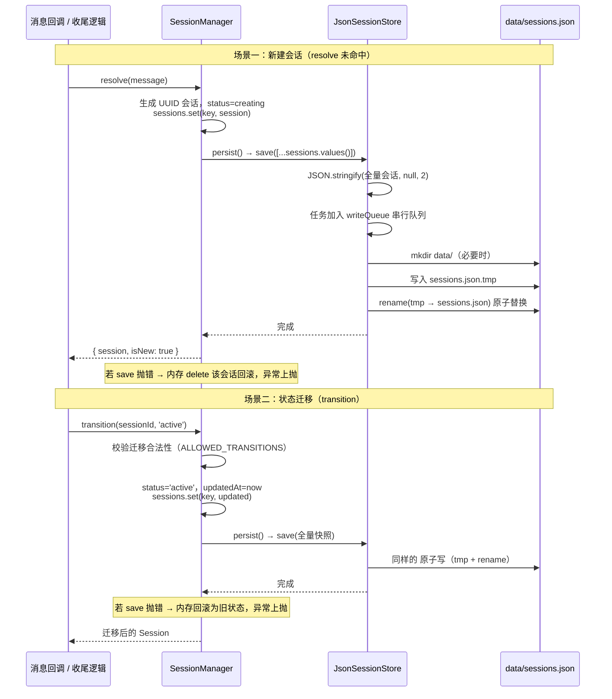
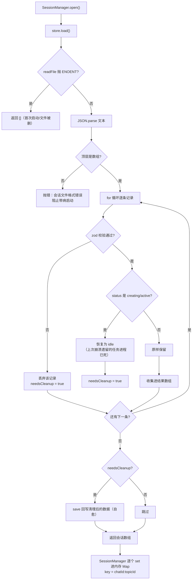
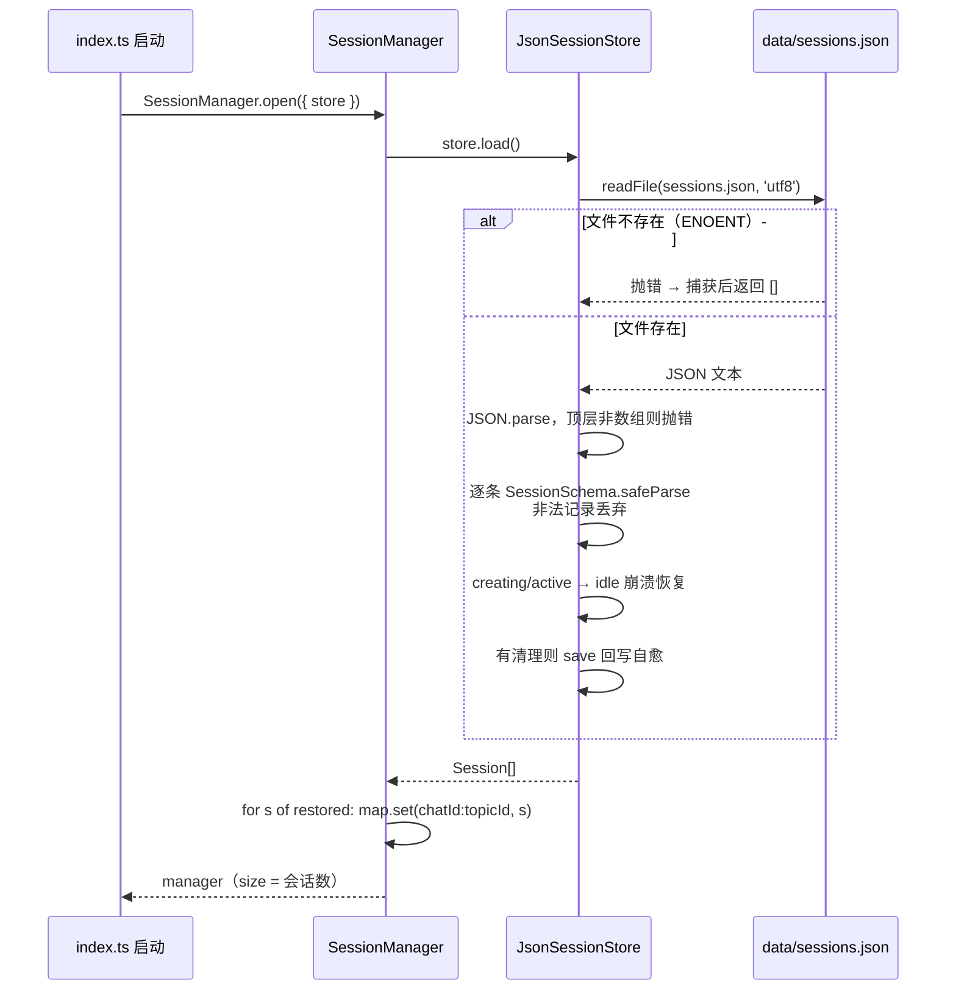
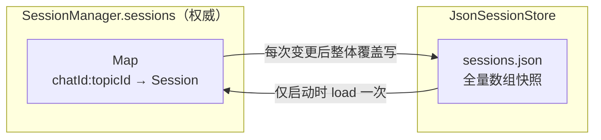

# 03 - 会话机制详解（sessions 的存取全流程）

> 本文回答两个核心问题：**本地 sessions 是怎么存的？又是怎么读的？**
> 涉及 `core/session-manager.ts`（内存侧）与 `core/session-store.ts`（磁盘侧）两个模块。

## 1. 会话长什么样

磁盘上 `data/sessions.json` 是一个**会话数组**，每个元素是一条会话记录：

```json
[
  {
    "id": "915685d1-cb62-4daa-8e1a-b7238c8e49e9",
    "threadId": "omt_19e775499c4f5b9f",
    "chatId": "oc_58d45cc4d42d4a79a07276d7acdc80eb",
    "cliId": "claude",
    "status": "idle",
    "createdAt": "2026-08-17T12:24:33.269Z",
    "updatedAt": "2026-08-17T12:24:40.253Z"
  }
]
```

| 字段 | 含义 | 谁生成 |
| --- | --- | --- |
| `id` | 会话唯一 ID（UUID） | `createId()`，默认 `randomUUID` |
| `threadId` | 话题 ID（同一话题所有消息共享） | 消息事件 |
| `chatId` | 会话 ID（单聊/群聊标识） | 消息事件 |
| `cliId` | 执行引擎，当前固定 `'claude'` | 硬编码 |
| `status` | 四态：`creating` / `active` / `idle` / `closed` | 状态机 |
| `createdAt` | 创建时间（ISO 8601） | resolve 新建时 |
| `updatedAt` | 最近变更时间（ISO 8601） | 每次迁移时刷新 |

> 存储路径由入口处指定：`new JsonSessionStore(join("data", "sessions.json"))`。
> 会话量小（一个话题一条），所以采用"全量数组 + 每次整体覆盖写"的简单方案。

## 2. 会话状态机



**合法性约束**（`ALLOWED_TRANSITIONS`，非法迁移直接抛错）：

| 当前状态 | 允许迁移到 |
| --- | --- |
| `creating` | `active`、`closed` |
| `active` | `idle`、`closed` |
| `idle` | `active`、`closed` |
| `closed` | （无，终态） |

## 3. 会话如何定位（键的设计）

同一个 `chatId` 下可能有多个话题，所以会话唯一键是 **chatId + topicId**：



**设计含义**：

- 话题内消息共享一个会话（`threadId` / `rootId` 通常成对出现）；
- 单聊（无话题）时退化为 `messageId`，即**每条消息一个会话**，互不干扰；
- 键里带 chatId，不同群/单聊的同名话题互不串扰。

## 4. 写入流程（存）

### 4.1 写入时机

| 触发点 | 代码位置 | 写入内容 |
| --- | --- | --- |
| 新建会话（首条消息） | `resolve()` 内 | 新增一条 `creating` 会话 |
| 状态迁移 | `transition()` 内 | 更新对应会话的 status + updatedAt |
| 加载时发现脏数据 | `load()` 内 | 回写清理后的数据（自愈） |

每次写入都是**全量快照**：`persist()` 把内存 Map 里所有会话序列化后整体覆盖写文件。

### 4.2 写入时序



### 4.3 写入的可靠性设计（三个关键点）

1. **原子写**：先写 `sessions.json.tmp`，再 `rename` 覆盖正式文件。写一半崩溃/断电时，正式文件保持旧内容，不会被写坏；
2. **串行写队列**：`writeQueue` 是一个 Promise 链，每次 `save` 都追加到链尾。即使多个会话并发触发写盘，文件也是按顺序一个个完整写入，杜绝并发交错；
3. **失败回滚**：内存先变更、磁盘后写入；磁盘失败时内存回滚，保证"内存 = 磁盘"。

## 5. 读取流程（读）

### 5.1 启动恢复（唯一读取入口）

只有**进程启动时**读一次文件：`SessionManager.open()` → `store.load()`。



### 5.2 读取时序



### 5.3 读取时的三种"脏数据"处理

| 情况 | 处理 |
| --- | --- |
| 文件不存在 | 返回空数组，正常启动（首次运行） |
| 顶层不是数组 | 抛错终止启动（文件被手动改坏） |
| 单条记录校验失败 | 丢弃该条 + 整体回写清理（自愈） |
| 遗留 creating/active | 重置为 idle + 回写（崩溃恢复） |

## 6. 内存与磁盘的一致性保证



- **查询路径**：永远走内存 Map（零 IO）；
- **写入路径**：每次变更（新建/迁移）后全量写盘；
- **恢复路径**：仅启动时 load 一次，重建内存；
- **失败路径**：写盘失败 → 内存回滚/删除，保持两边一致。

## 7. 常见问题速查

| 问题 | 答案 |
| --- | --- |
| 会话存在哪个文件？ | `data/sessions.json`（入口处写死相对路径） |
| 什么时候写盘？ | 新建会话时、每次状态迁移时、load 发现脏数据时 |
| 什么时候读盘？ | 只有进程启动时 |
| 重启后会话是什么状态？ | 之前是 idle/closed 的原样保留；creating/active 自动恢复成 idle |
| 写一半断电会坏文件吗？ | 不会，先写 .tmp 再 rename 原子替换 |
| 多个写并发会交错吗？ | 不会，writeQueue 串行队列保证顺序 |
| 一个话题最多几个会话？ | 一个（chatId:topicId 唯一键） |
| 单聊怎么分会话？ | 无话题时按 messageId 兜底，每条消息一个会话 |
| 手动改坏文件会怎样？ | 非法记录被丢弃并回写清理；顶层非数组则拒绝启动 |
