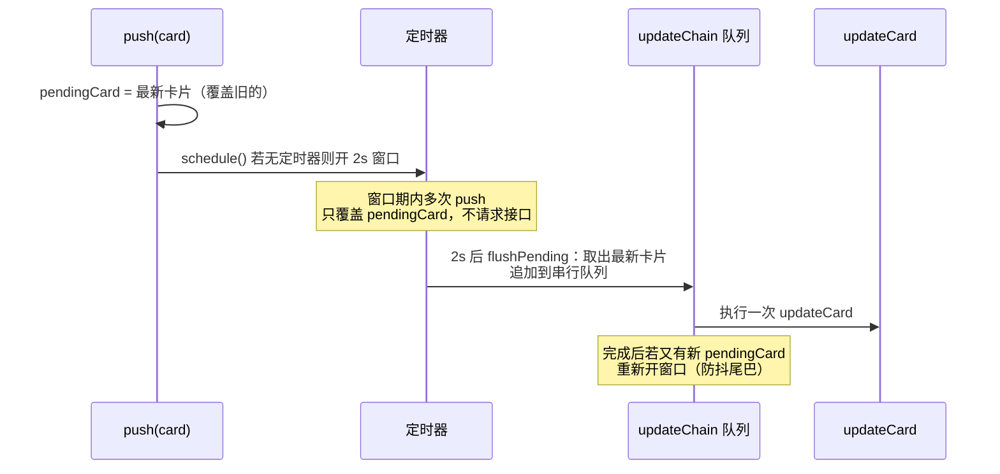

# 04 - 模块代码详解

> 逐个源文件、逐段讲解"每一行在干什么"。建议对照源码阅读。

---

## 1. `src/index.ts` — 入口与消息主流程

### 1.1 启动段（顶部）

```ts
import 'dotenv/config';                    // 把 .env 里的变量注入 process.env
const appId = process.env.BOT_A_APP_ID;    // 读飞书应用凭证
const appSecret = process.env.BOT_A_APP_SECRET;
if (!appId || !appSecret) {                // 凭证缺失 → 报错退出，不给半残运行
    console.error('缺少 BOT_A_APP_ID / BOT_A_APP_SECRET，请检查 .env');
    process.exit(1);
}

const sessions = await SessionManager.open({
    store: new JsonSessionStore(join("data", "sessions.json")),  // 指定会话文件路径
});
console.log(`[会话] 已恢复 ${sessions.size} 个会话`);            // 启动日志

const activeRuns = new Map<string, AbortController>();          // 运行中任务表
```

### 1.2 消息回调（onMessage）逐步拆解

| 代码块 | 在干什么 | 说明 |
| --- | --- | --- |
| `resolveMentions(msg.text, msg.mentions)` | 还原 @提及 | 把 `@_user_2` 变成 `@运营专家`，供后续 AI 理解 |
| `hasThread = !!msg.threadId \|\| !!msg.rootId` | 判断是否话题内 | 决定回复用不用 `reply_in_thread: true` |
| `sessions.resolve(msg)` | 定位会话 | 同话题复用；新话题创建并落盘（见 doc/03） |
| 4 个 `console.log` | 打调试日志 | 原文、还原后文本、mentions、会话状态 |
| `parseCommand(resolved)` | 命令分发 | 只有 /help /status /close 会命中 |
| 三个命令分支 | 直接回复并 `return` | 不进入任务流程 |
| 状态拦截（closed/creating/active） | 拒收非法消息 | 保证一个话题同时只跑一个任务 |
| `sessions.transition(session.id, 'active')` | 状态机进入执行中 | 落盘 |
| `new AbortController()` + `activeRuns.set` | 登记中止句柄 | /close 可中止 |
| `extractResourceKeys` + `downloadResource` | 下载图片/文件 | 存到 `data/downloads/` |
| `bot.replyCard(..., buildTaskCard(running))` | 发运行中卡片 | 拿到的 `cardId` 是后续所有更新的锚点 |
| 发卡片失败 / 无 message_id | 收尾退出 | 清理句柄 + `markSessionIdle` |
| `void runCardDemo(...).catch().finally()` | 后台执行 | 回调立即返回；finally 统一收尾回 idle |

---

## 2. `src/im/lark.ts` — 飞书机器人封装

### 2.1 连接方案

```
飞书 SDK 的 WSClient 主动建立 WebSocket 长连接（长轮询），
服务端通过通道推送事件 → EventDispatcher 分发到已注册的处理器。
```

- **优点**：不需要公网域名、不需要 HTTPS 回调地址，本地/内网直接跑；
- **需要权限**：飞书后台开通「消息与事件接收」。

### 2.2 事件入口

```ts
' im.message.receive_v1': async (data) => {
    const m = data.message;          // 原始消息
    // 组装标准化 IncomingMessage：
    // text 用 extractText 按消息类型提取纯文本
    // mentions 用 parseMentions 提取 @占位符信息
    // rootId / threadId 透传（会话定位的依据）
    await onMessage(msg, bot);       // 交给业务回调（index.ts）
}
```

### 2.3 Bot 对外四个能力

| 方法 | 底层飞书接口 | 作用 |
| --- | --- | --- |
| `reply` | `im.v1.message.reply` | 回复文本消息；可选 `reply_in_thread` 进话题 |
| `replyCard` | `im.v1.message.reply`（msg_type=interactive） | 回复卡片消息 |
| `updateCard` | `im.v1.message.patch` | 更新已发卡片（进度刷新） |
| `downloadResource` | `im.v1.messageResource.get` | 下载消息中的图片/文件到本地 |

### 2.4 资源下载细节

- `getHeader`：兼容 Headers 对象和普通对象，取 `content-type`；
- `resourceExtension`：扩展名优先级 = 原始文件名 > Content-Type 映射 > 兜底（img/bin）；
- 保存路径：`data/downloads/<fileKey>.<ext>`，目录不存在自动递归创建。

---

## 3. `src/im/message-parser.ts` — 消息解析

| 函数 | 输入 → 输出 | 做什么 |
| --- | --- | --- |
| `parseMentions` | 飞书 mentions 数组 → `Mention[]` | 提取 key（占位符）/ name（显示名）/ openId |
| `resolveMentions` | 文本 + mentions → 还原后文本 | `replaceAll` 把 `@_user_N` 换成 `@显示名` |
| `extractResourceKeys` | 消息类型 + content → 资源列表 | 提取 image_key / file_key，支持 text/image/file/post 四种消息 |

**为什么需要还原 @**：飞书文本里的 @ 只是占位符（如 `@_user_1`），人眼看不出是谁。AI 消费消息时必须看到 `@运营专家` 这种真实名字；将来 bot 要 @ 真人时，用 `openId` 构造 `<at user_id="ou_xxx">` 标签。

---

## 4. `src/im/card.ts` — 任务卡片

### 4.1 `buildTaskCard` — 构建卡片 JSON

- `schema: "2.0"`：飞书新版卡片协议；
- `config.update_multi: true`：共享卡片，`updateCard` 后**所有看过这条消息的人**都会看到刷新；
- `config.summary`：聊天列表预览文字（"标题：运行中"），不点开也能看状态；
- `header.template`：blue=运行中 / green=已完成 / red=执行失败；
- body 内容：状态 + 10 格进度条（█░）+ 当前动作 + 最近进展列表 + 禁用按钮；
- `clampProgress`：进度钳制到 0-100 整数。

### 4.2 `ThrottledCardUpdater` — 防抖更新器（核心）

**解决的问题**：模拟任务每 700ms 刷一次卡片，直接调飞书接口太频繁会触发限流。

**策略**（2 秒窗口）：



关键字段与语义：

| 字段 | 语义 |
| --- | --- |
| `pendingCard` | 待提交的最新卡片缓存（窗口内永远只留最新） |
| `timer` | 2 秒冷却窗口句柄；已存在则不重复开 |
| `updateChain` | Promise 串行链：更新请求**排队执行，杜绝并发** |
| `closed` | 结束后（finish/cancel）不再接收 push |

| 方法 | 行为 |
| --- | --- |
| `push(card)` | 覆盖缓存 + 维持/启动窗口 |
| `finish(finalCard)` | 清定时器、丢弃缓存、等队列排空、强制发最终卡片、永久关闭 |
| `cancel()` | 清定时器、丢弃缓存、等队列排空（不发最终卡片） |

---

## 5. `src/core/session-manager.ts` — 会话管理器

（内存侧，详细流程见 doc/03）

| 成员 | 作用 |
| --- | --- |
| `ALLOWED_TRANSITIONS` | 状态迁移白名单表（状态机核心约束） |
| `topicIdOf` | threadId → rootId → messageId 依次兜底 |
| `sessionKey` | `chatId:topicId` 唯一键 |
| `open()` | 静态异步工厂：load 磁盘 → 重建内存 Map |
| `resolve(message)` | 定位会话；未命中则创建（creating）+ 立即落盘，失败回滚 |
| `transition(id, next)` | 校验 → 更新 → 落盘，失败回滚 |
| `persist()` | 全量快照交给 store |
| `get(sessionId)` | 按会话 ID 查（线性扫描，量小无碍） |
| `size` | 会话总数（启动日志用） |

**测试友好**：构造参数可注入 `now`（时钟）和 `createId`（ID 生成器），方便单测。

---

## 6. `src/core/session-store.ts` — 会话文件存储

（磁盘侧，详细流程见 doc/03）

| 成员 | 作用 |
| --- | --- |
| `SessionSchema`（zod） | 逐字段校验磁盘数据；非法记录丢弃 |
| `recoverInterruptedSession` | creating/active → idle 崩溃恢复 |
| `load()` | 读文件 → parse → 校验 → 恢复 → 有脏数据则回写自愈 |
| `save(sessions)` | 全量序列化 → 写 .tmp → rename 原子替换 → 串行队列 |
| `writeQueue` | Promise 链，保证多个 save 按序执行 |

---

## 7. `src/core/command-parser.ts` — 命令解析

- 正则 `^(?:@.+\s+)?\/(close|status|help)\s*$` 逐段含义见源码注释；
- 只匹配"一行一个命令"，带尾缀文本（如 `/status 给我看看`）不会误判；
- 返回 `{ name }` 或 `undefined`。

---

## 8. `src/mock/index.ts` — 模拟任务（当前阶段的"假引擎"）

| 成员 | 作用 |
| --- | --- |
| `STATUS_LABELS` | 状态 → 中文标签 |
| `formatSessionStatus` | /status 命令的回复文本 |
| `wait(ms, signal)` | 可中止等待（abort 立即返回 false） |
| `DEMO_STEPS` | 8 个模拟执行步骤 |
| `runCardDemo` | 每 700ms 推进一步，防抖刷卡片，8 步后发 100% 完成卡片 |
| `markSessionIdle` | active → idle（仅当还是 active，避免覆盖 closed） |

**将来替换点**：`runCardDemo` 内部改成真实调用 Claude Code / Codex CLI（配合 `probe-cli` 解析输出），`DEMO_STEPS` 换成真实任务阶段即可。

---

## 9. `src/probe-cli.ts` — CLI 探测工具（独立）

- 从 stdin 逐行读取上游 CLI 的 stream-json 输出；
- 按事件类型翻译成人读日志：
  - **Claude Code**：`system(init)` 会话开始 → `assistant` 模型说话/调用工具 → `result` 完成统计；
  - **Codex**：`thread.started` 开始 → `item.completed` 回答/执行命令 → `turn.completed` token 统计；
- 非 JSON 行（日志噪音）直接跳过；
- 用法：`claude -p "..." --output-format stream-json --verbose | pnpm probe:cli`。

---

## 10. 调用关系速查表（谁调谁）

| 调用方 | 被调用方 | 用途 |
| --- | --- | --- |
| index.ts | lark.startBot | 启动长连接 + 注册消息回调 |
| index.ts | SessionManager.open / resolve / transition | 会话全生命周期 |
| index.ts | JsonSessionStore | 指定会话文件 |
| index.ts | parseCommand | 命令分发 |
| index.ts | resolveMentions / extractResourceKeys | 消息加工 |
| index.ts | buildTaskCard | 首张运行中卡片 |
| index.ts | runCardDemo / markSessionIdle / formatSessionStatus | 演示任务与收尾 |
| lark.ts | parseMentions | 提取提及 |
| mock | ThrottledCardUpdater + buildTaskCard | 进度卡片防抖刷新 |
| mock | bot.updateCard | 更新卡片 |
| mock | SessionManager.transition / get | 会话收尾 |
| SessionManager | SessionStore.load / save | 持久化 |
